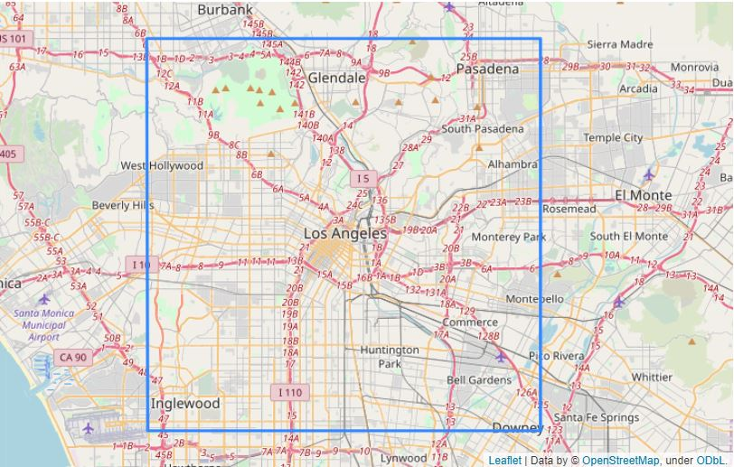
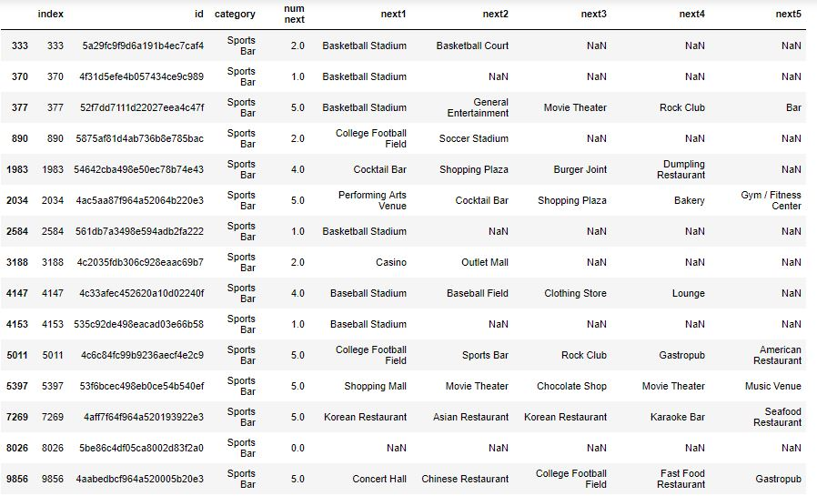
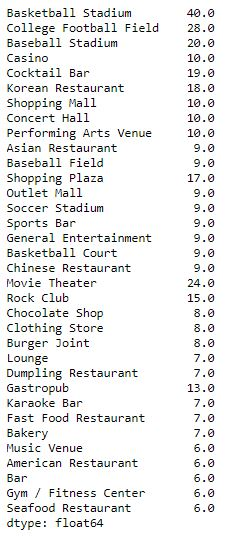
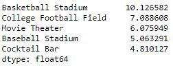

# Targeting Consumers According to Venue Categories in Los Angeles, USA

## Introduction/Business Problem

Is a person visiting an art gallery likely to next visit a French restaurant? Is a person visiting a metro station likely to next visit a tailor shop? In general, is a person visiting a venue of category *x* likely to next visit a venue of category *y*? In this project, pairs (*x*, *y*) were found for which the answer is Yes.

This problem is relevant to anyone who delivers targeted advertising to consumers. Advertising seeks to change consumer behavior, but the most likely changes are those that remain within the bounds of normal behavior. Let *P*(*x*, *y*) denote the probability that a person visiting a venue of category *x* next visits a venue of category *y*. If *P*(*x*, *y*) is high, then it makes sense to advertise venues of category *y* to people currently located at venues of category *x*.

### Alternative approaches not considered

It is possible to ask a more specific question: is a person visiting venue *v* likely to next visit a venue of category *y*? Or even more specific: is a person visiting venue *v* likely to next visit venue *w*? These questions were not considered in this study because the available data was very limited. In order to obtain adequate sample sizes, it was necessary to aggregate the results of multiple venues within a category.

## Data

### Data sources

Data for this project came from Foursquare. Foursquare has a large database of venues. Each venue has a category. Many Foursquare users frequently notify Foursquare that they are currently located at one of these venues. This is called **checking in** at the venue.

The Foursquare API includes a feature called "Get Next Venues" or "nextvenues". Here is the description from [the API documentation](https://developer.foursquare.com/docs/api/venues/nextvenues): 

> Returns venues that people often check in to after the current venue. Up to 5 venues are returned in each query, and results are sorted by how many people have visited that venue after the current one. 

The output of this feature also includes the category of each returned venue.

### Venue selection

The region of study, shown in the figure below, was a square, 25 kilometers by 25 kilometers, centered at 34.052200° N, 118.243700° W. These coordinates were obtained by searching Google for "los angeles lat/lon".

Forsquare's "explore" query was used to find a random selection of venues within the study area. This query returns data on venues within a specified radius of a specified point.

Experiments were performed in which the center point was chosen randomly within the study area and the query radius was varied. It was found that at most 100 venues were returned, even if a limit > 100 was specified in the query. Queries returning exactly 100 venues were problematic, for reasons explained below. A radius of 1000 meters was chosen because it usually yielded between 10 and 99 venues.

Many queries returned exactly 100 venues. Most likely, this means there were *n* > 100 venues within the query radius. It was not known how Foursquare chooses 100 out of the _n_ venues. Its selection rule could cause an unknown bias. Therefore, when a query returned 100 venues, these results were not used. However, if these results were simply ignored, that would undersample areas with a high density of venues. To avoid this problem, whenever a query returned 100 venues, it was replaced with four more queries with half the radius. These four queries covered the same total area as the original query.

A function `get_nearby_venues_unbiased` was written to get venues within 1000 meters of a specified point, and replace this query with four more queries when necessary. `get_nearby_venues_unbiased` was called repeatedly with random locations until at least 10,000 different venues were found within the study area. For each venue, only its ID and category were saved.

### Obtaining next venues

A Foursquare nextvenues query was executed for each of the 10,000 venues found. The numbers of next venues returned from each query varied:

 * 5045 venues had no next venues
 * 1041 venues had one next venue
 * 626 venues had two next venues
 * 440 venues had three next venues 
 * 288 venues had four next venues 
 * 2560 venues had five next venues  

 Only the categories of the next venues were saved.

## Methodology

To illustrate the methodology, the data in the "Sports Bar" category is presented below: 

Each row is a venue. Where do people go after visiting this venue? For each venue, Foursquare has given up to five likely answers. The categories of these five are in columns next1 through next5.

Below are shown the counts of occurrences of categories in the column next1:

")

This is repeated for columns next2 through next5, and the results are combined:

")

It would be desirable to add up the total number of times people went to these other venues after a sports bar. Foursquare does not provide these numbers, but it does order the next venues using these numbers in descending order. Therefore, higher weight is given to those earlier in the list. A wild guess was made that the best weights for columns next1 through next5 were 10, 9, 8, 7, and 6 respectively. The weighted scores are shown below:

 weighted")

The total score for each category is obtained by adding across the rows:

Finally, these scores are converted to percentages by dividing by the total, and the top five are listed in descending order:

Thus, it is estimated that someone at a sports bar has a 10.1 percent chance of next visiting a basketball stadium, and that the next four most likely categories are baseball stadium, college football field, Korean restaurant, and rock club.

### Categories included

The computation above was repeated for all 122 categories in which there were  

  1. at least 10 venues with next venues
  2. a total of at least 20 next venues. 

## Results

Results are shown in the table below:

| | # of Venues | # of Venues With Next | Total # of Next Venues | Next Category #1 | Pct. #1 | Next Category #2 | Pct. #2 | Next Category #3 | Pct. #3 | Next Category #4 | Pct. #4 | Next Category #5 | Pct. #5 |
| ---:| ---:| ---:| ---:| ---:| ---:| ---:| ---:| ---:| ---:| ---:| ---:| ---:| ---:| 
| American Restaurant | 154 | 102 | 399 | Coffee Shop | 6.8 | Shopping Mall | 6.3 | Bar | 4.9 | Grocery Store | 4.5 | Ice Cream Shop | 3.7 |
| Art Gallery | 87 | 46 | 156 | Art Gallery | 24.7 | Bar | 6.8 | Art Museum | 5.6 | Garden | 2.9 | Gastropub | 2.8 |
| Art Museum | 20 | 14 | 59 | Art Museum | 28.4 | Coffee Shop | 11.5 | Sculpture Garden | 7.3 | New American Restaurant | 6.9 | Historic Site | 6.9 |
| Arts & Crafts Store | 32 | 18 | 72 | Shopping Mall | 11.0 | Coffee Shop | 6.2 | Bookstore | 4.6 | Flower Shop | 4.4 | Furniture / Home Store | 4.4 |
| Asian Restaurant | 90 | 36 | 114 | Coffee Shop | 12.6 | Bubble Tea Shop | 8.3 | Dessert Shop | 7.1 | Grocery Store | 7.1 | Ice Cream Shop | 6.8 |
| BBQ Joint | 36 | 20 | 73 | Dessert Shop | 6.9 | Ice Cream Shop | 6.5 | Coffee Shop | 5.9 | Café | 5.4 | Shopping Mall | 3.9 |
| Bakery | 149 | 73 | 242 | Coffee Shop | 11.1 | Shopping Mall | 8.0 | Grocery Store | 6.2 | Bakery | 4.7 | Café | 4.6 |
| Bank | 69 | 47 | 159 | Grocery Store | 15.3 | Coffee Shop | 13.6 | Pharmacy | 9.0 | Supermarket | 8.7 | Shopping Mall | 6.9 |
| Bar | 116 | 97 | 413 | Bar | 19.0 | Gastropub | 4.5 | Cocktail Bar | 4.2 | Mexican Restaurant | 3.3 | Lounge | 3.3 |
| Big Box Store | 15 | 15 | 66 | Grocery Store | 17.0 | Coffee Shop | 12.2 | Shopping Mall | 10.3 | Supermarket | 6.0 | Pharmacy | 5.6 |
| Bookstore | 32 | 22 | 88 | Movie Theater | 6.3 | Record Shop | 6.3 | Coffee Shop | 5.5 | Bookstore | 4.5 | Shopping Mall | 4.3 |
| Boutique | 48 | 28 | 99 | Clothing Store | 15.0 | Boutique | 11.3 | Coffee Shop | 9.0 | Men's Store | 6.4 | Shoe Store | 6.4 |
| Breakfast Spot | 57 | 42 | 172 | Coffee Shop | 19.7 | Shopping Mall | 10.2 | Grocery Store | 6.3 | Big Box Store | 4.5 | Movie Theater | 4.0 |
| Brewery | 17 | 17 | 80 | Brewery | 27.2 | Bar | 12.4 | German Restaurant | 4.8 | Mexican Restaurant | 4.3 | Cocktail Bar | 3.9 |
| Bubble Tea Shop | 28 | 18 | 58 | Shopping Mall | 9.8 | Bakery | 8.0 | Korean Restaurant | 7.3 | Shoe Store | 7.3 | Plaza | 7.1 |
| Burger Joint | 183 | 82 | 296 | Coffee Shop | 8.9 | Big Box Store | 7.3 | Movie Theater | 6.1 | Shopping Mall | 5.9 | Grocery Store | 5.1 |
| Café | 195 | 98 | 364 | Shopping Mall | 9.1 | Coffee Shop | 7.1 | Grocery Store | 4.3 | Bakery | 3.9 | Café | 3.0 |
| Candy Store | 17 | 11 | 45 | Movie Theater | 9.3 | Shopping Mall | 9.3 | Farmers Market | 7.9 | Theme Park Ride / Attraction | 6.8 | Shopping Plaza | 5.2 |
| Chinese Restaurant | 166 | 95 | 297 | Bubble Tea Shop | 12.4 | Tea Room | 9.8 | Plaza | 6.0 | Coffee Shop | 5.5 | Grocery Store | 5.3 |
| Clothing Store | 124 | 76 | 317 | Clothing Store | 20.9 | Department Store | 5.9 | Shopping Mall | 5.8 | Big Box Store | 5.3 | Coffee Shop | 4.6 |
| Cocktail Bar | 51 | 44 | 184 | Bar | 19.3 | Cocktail Bar | 7.4 | American Restaurant | 5.4 | Burger Joint | 4.0 | Diner | 3.3 |
| Coffee Shop | 375 | 243 | 923 | Shopping Mall | 7.9 | Grocery Store | 6.6 | Big Box Store | 4.2 | Supermarket | 2.9 | Bookstore | 2.4 |
| Comedy Club | 16 | 14 | 59 | Bar | 12.7 | Comedy Club | 10.6 | Diner | 7.3 | Café | 7.1 | American Restaurant | 6.7 |
| Concert Hall | 15 | 11 | 45 | Bar | 12.5 | American Restaurant | 6.2 | Mexican Restaurant | 6.0 | Coffee Shop | 6.0 | Art Museum | 5.2 |
| Convenience Store | 190 | 67 | 193 | Fast Food Restaurant | 13.1 | Supermarket | 7.7 | Grocery Store | 7.1 | Pharmacy | 5.8 | Coffee Shop | 4.1 |
| Cosmetics Shop | 80 | 37 | 121 | Shopping Mall | 14.0 | Coffee Shop | 11.4 | Clothing Store | 9.0 | Department Store | 6.7 | Big Box Store | 5.5 |
| Deli / Bodega | 42 | 14 | 42 | Coffee Shop | 19.2 | Shopping Mall | 7.1 | Grocery Store | 7.1 | Art Museum | 6.2 | Comedy Club | 5.6 |
| Department Store | 42 | 26 | 106 | Shopping Mall | 14.7 | Department Store | 12.0 | Clothing Store | 8.6 | Big Box Store | 7.8 | Grocery Store | 6.2 |
| Dessert Shop | 52 | 34 | 116 | Bubble Tea Shop | 7.0 | Shopping Mall | 6.6 | Korean Restaurant | 6.4 | Café | 5.1 | Movie Theater | 4.8 |
| Dim Sum Restaurant | 11 | 10 | 39 | Bubble Tea Shop | 16.1 | Tea Room | 13.3 | Grocery Store | 10.2 | Bakery | 9.9 | Plaza | 7.7 |
| Diner | 46 | 34 | 132 | Coffee Shop | 12.2 | Shopping Mall | 7.2 | Movie Theater | 6.3 | Big Box Store | 5.3 | Ice Cream Shop | 4.9 |
| Discount Store | 49 | 27 | 85 | Grocery Store | 23.8 | Big Box Store | 12.5 | Supermarket | 10.1 | Pharmacy | 7.9 | Discount Store | 7.5 |
| Dive Bar | 19 | 14 | 57 | Bar | 16.1 | Dive Bar | 9.4 | Mexican Restaurant | 6.4 | Diner | 6.2 | Gastropub | 5.4 |
| Donut Shop | 97 | 25 | 83 | Grocery Store | 11.0 | Shopping Mall | 10.3 | Coffee Shop | 9.5 | Theme Park | 7.6 | Movie Theater | 3.7 |
| Farmers Market | 22 | 14 | 61 | Coffee Shop | 15.1 | Grocery Store | 13.5 | Bakery | 6.9 | Shopping Mall | 4.0 | Park | 4.0 |
| Fast Food Restaurant | 257 | 125 | 350 | Grocery Store | 10.4 | Big Box Store | 7.3 | Coffee Shop | 7.2 | Supermarket | 6.9 | Pharmacy | 6.9 |
| Flea Market | 17 | 10 | 35 | Coffee Shop | 12.4 | Shopping Mall | 9.6 | Brewery | 6.5 | Plaza | 6.5 | Neighborhood | 5.8 |
| Food Court | 25 | 21 | 86 | Shopping Mall | 6.1 | Big Box Store | 5.0 | Coffee Shop | 4.7 | General Entertainment | 3.7 | Science Museum | 3.7 |
| Food Truck | 133 | 22 | 51 | Food Truck | 19.4 | Coffee Shop | 12.7 | Art Museum | 8.9 | Bar | 6.0 | Cocktail Bar | 4.5 |
| French Restaurant | 32 | 25 | 113 | Shopping Mall | 9.3 | Coffee Shop | 6.3 | Bar | 5.4 | Art Museum | 5.2 | American Restaurant | 4.5 |
| Fried Chicken Joint | 73 | 21 | 59 | Shopping Mall | 8.0 | Coffee Shop | 7.5 | Ice Cream Shop | 6.5 | Café | 5.5 | Pharmacy | 5.5 |
| Frozen Yogurt Shop | 23 | 12 | 49 | Grocery Store | 14.6 | Coffee Shop | 14.1 | Supermarket | 6.2 | Big Box Store | 5.7 | Shopping Mall | 4.7 |
| Furniture / Home Store | 64 | 25 | 92 | Grocery Store | 9.1 | Furniture / Home Store | 8.0 | Coffee Shop | 6.3 | Shopping Mall | 5.6 | Big Box Store | 5.3 |
| Garden | 26 | 21 | 64 | Garden | 45.4 | Tea Room | 16.1 | Museum | 11.9 | Park | 7.8 | Grocery Store | 3.5 |
| Gas Station | 42 | 20 | 46 | Supermarket | 13.8 | Coffee Shop | 12.2 | Fast Food Restaurant | 10.5 | Grocery Store | 9.2 | Pharmacy | 7.8 |
| Gastropub | 23 | 19 | 88 | Bar | 21.2 | Gastropub | 4.1 | Cocktail Bar | 3.7 | Music Venue | 3.7 | Dive Bar | 3.5 |
| General Entertainment | 17 | 16 | 58 | Film Studio | 11.7 | Museum | 9.0 | Café | 7.0 | Bar | 5.5 | Shopping Plaza | 5.3 |
| Gift Shop | 45 | 33 | 121 | Gift Shop | 7.3 | Coffee Shop | 6.9 | Movie Theater | 5.6 | Shopping Mall | 4.9 | Theme Park | 4.9 |
| Golf Course | 14 | 10 | 27 | Golf Course | 33.5 | Diner | 8.6 | Park | 8.2 | American Restaurant | 6.4 | Grocery Store | 6.4 |
| Grocery Store | 165 | 104 | 410 | Grocery Store | 18.7 | Supermarket | 9.1 | Coffee Shop | 9.0 | Pharmacy | 8.8 | Big Box Store | 6.3 |
| Gym | 75 | 33 | 109 | Grocery Store | 19.1 | Coffee Shop | 8.4 | Supermarket | 8.0 | Shopping Mall | 6.4 | Juice Bar | 4.6 |
| Gym / Fitness Center | 96 | 35 | 125 | Grocery Store | 17.6 | Supermarket | 7.5 | Big Box Store | 6.6 | Coffee Shop | 6.3 | Juice Bar | 6.1 |
| Hardware Store | 18 | 11 | 47 | Grocery Store | 12.6 | Big Box Store | 11.3 | Coffee Shop | 11.1 | Supermarket | 11.1 | Fast Food Restaurant | 7.6 |
| Historic Site | 24 | 14 | 50 | Mexican Restaurant | 11.2 | Pedestrian Plaza | 6.9 | Museum | 6.9 | Shopping Mall | 6.7 | Historic Site | 6.4 |
| History Museum | 19 | 15 | 59 | Museum | 19.0 | History Museum | 18.8 | Park | 9.4 | Science Museum | 9.0 | Historic Site | 6.1 |
| Hot Dog Joint | 21 | 13 | 44 | Big Box Store | 9.9 | Coffee Shop | 8.2 | Shopping Mall | 6.6 | Baseball Stadium | 5.5 | Ice Cream Shop | 4.9 |
| Hotel | 114 | 76 | 325 | Coffee Shop | 6.5 | Shopping Mall | 6.0 | Bar | 5.5 | American Restaurant | 4.9 | Hotel Bar | 4.7 |
| Hotel Bar | 18 | 17 | 61 | Hotel | 14.7 | Cocktail Bar | 10.0 | Hotel Bar | 9.2 | Burger Joint | 9.0 | Basketball Stadium | 7.9 |
| Ice Cream Shop | 101 | 46 | 165 | Coffee Shop | 8.6 | Grocery Store | 6.4 | Supermarket | 5.5 | Shopping Mall | 5.5 | Movie Theater | 5.0 |
| Indian Restaurant | 32 | 21 | 55 | Coffee Shop | 12.6 | Bakery | 9.2 | Café | 8.2 | Shopping Mall | 7.5 | Pub | 6.1 |
| Italian Restaurant | 109 | 77 | 290 | Ice Cream Shop | 8.3 | Coffee Shop | 6.3 | Shopping Mall | 5.5 | Bar | 5.4 | Movie Theater | 5.3 |
| Japanese Restaurant | 89 | 52 | 194 | Coffee Shop | 10.2 | Ice Cream Shop | 8.7 | Bakery | 7.1 | Bar | 6.1 | Café | 5.7 |
| Juice Bar | 70 | 39 | 139 | Coffee Shop | 13.1 | Shopping Mall | 8.0 | Grocery Store | 6.7 | Bakery | 4.5 | Big Box Store | 4.2 |
| Korean Restaurant | 143 | 82 | 281 | Dessert Shop | 15.8 | Bubble Tea Shop | 10.3 | Ice Cream Shop | 9.9 | Coffee Shop | 8.5 | Korean Restaurant | 8.5 |
| Latin American Restaurant | 49 | 14 | 32 | Ice Cream Shop | 19.9 | Bar | 13.5 | Mexican Restaurant | 8.9 | Bakery | 7.1 | Korean Restaurant | 6.8 |
| Lounge | 42 | 31 | 119 | Bar | 13.1 | Mediterranean Restaurant | 8.4 | Nightclub | 7.2 | Lounge | 5.8 | Diner | 4.4 |
| Mediterranean Restaurant | 67 | 40 | 144 | Café | 9.2 | Coffee Shop | 7.4 | Shopping Mall | 7.1 | Bar | 4.2 | Ice Cream Shop | 4.1 |
| Men's Store | 24 | 14 | 53 | Clothing Store | 25.3 | Shopping Mall | 9.3 | Coffee Shop | 8.4 | Boutique | 8.2 | Department Store | 7.3 |
| Mexican Restaurant | 455 | 169 | 566 | Coffee Shop | 7.3 | Shopping Mall | 4.8 | Grocery Store | 4.6 | Bar | 4.4 | Big Box Store | 4.0 |
| Middle Eastern Restaurant | 27 | 15 | 50 | Shopping Plaza | 15.9 | Café | 8.8 | Shopping Mall | 7.1 | Bakery | 6.6 | Bar | 4.7 |
| Mobile Phone Shop | 67 | 12 | 26 | Coffee Shop | 15.6 | Shopping Mall | 11.7 | Supermarket | 8.7 | Electronics Store | 8.7 | Big Box Store | 8.2 |
| Movie Theater | 41 | 26 | 115 | Coffee Shop | 5.0 | Shopping Mall | 4.6 | Bar | 4.6 | Film Studio | 4.3 | Shopping Plaza | 4.1 |
| Museum | 39 | 31 | 131 | Museum | 10.1 | Science Museum | 6.1 | Historic Site | 6.1 | Park | 5.0 | Café | 4.4 |
| Music Venue | 54 | 29 | 102 | Bar | 11.0 | Diner | 6.8 | Theater | 5.0 | Music Venue | 5.0 | Burger Joint | 4.7 |
| New American Restaurant | 42 | 31 | 124 | Shopping Mall | 6.6 | Bar | 5.8 | Cocktail Bar | 5.5 | Coffee Shop | 5.3 | Concert Hall | 4.1 |
| Nightclub | 28 | 15 | 62 | Diner | 13.8 | Mediterranean Restaurant | 9.3 | Lounge | 9.3 | Cocktail Bar | 6.9 | Bar | 5.3 |
| Noodle House | 24 | 18 | 71 | Ice Cream Shop | 13.3 | Coffee Shop | 12.8 | Bubble Tea Shop | 6.6 | Shopping Mall | 6.1 | Dessert Shop | 5.3 |
| Park | 184 | 74 | 220 | Park | 6.9 | Trail | 5.0 | Coffee Shop | 4.8 | Grocery Store | 4.7 | Supermarket | 4.6 |
| Performing Arts Venue | 23 | 13 | 41 | Theater | 15.3 | Bar | 6.3 | American Restaurant | 4.9 | Park | 4.9 | Historic Site | 4.6 |
| Pet Store | 55 | 27 | 95 | Grocery Store | 21.5 | Supermarket | 5.4 | Big Box Store | 5.3 | Shopping Mall | 4.5 | Coffee Shop | 4.1 |
| Pharmacy | 136 | 80 | 305 | Grocery Store | 22.3 | Fast Food Restaurant | 10.1 | Coffee Shop | 8.9 | Supermarket | 8.7 | Big Box Store | 5.8 |
| Pizza Place | 262 | 75 | 223 | Coffee Shop | 8.4 | Bar | 6.2 | Ice Cream Shop | 6.0 | Grocery Store | 5.3 | Movie Theater | 4.3 |
| Playground | 26 | 10 | 33 | Park | 12.8 | Historic Site | 9.2 | Zoo Exhibit | 7.8 | Playground | 6.7 | Museum | 6.0 |
| Plaza | 20 | 15 | 60 | Coffee Shop | 8.3 | Korean Restaurant | 6.9 | Mexican Restaurant | 5.9 | Plaza | 5.5 | Concert Hall | 5.3 |
| Poke Place | 19 | 10 | 23 | Coffee Shop | 18.1 | Bakery | 16.7 | Shopping Mall | 13.7 | Donut Shop | 7.8 | Grocery Store | 4.9 |
| Pub | 14 | 13 | 58 | Bar | 14.6 | Pub | 9.8 | Gay Bar | 8.5 | American Restaurant | 5.5 | Coffee Shop | 5.1 |
| Ramen Restaurant | 21 | 19 | 69 | Ice Cream Shop | 13.0 | Bakery | 11.8 | Coffee Shop | 11.4 | Bubble Tea Shop | 8.8 | Bar | 8.6 |
| Record Shop | 17 | 11 | 36 | Record Shop | 20.1 | Burger Joint | 8.3 | Coffee Shop | 7.9 | Donut Shop | 6.6 | Bookstore | 5.3 |
| Restaurant | 113 | 40 | 131 | Coffee Shop | 7.3 | Bakery | 5.8 | Bar | 5.7 | Ice Cream Shop | 4.0 | Shopping Mall | 3.4 |
| Salad Place | 20 | 14 | 63 | Coffee Shop | 15.1 | Shopping Mall | 8.3 | Grocery Store | 7.1 | Performing Arts Venue | 6.5 | Big Box Store | 5.3 |
| Salon / Barbershop | 30 | 14 | 32 | Coffee Shop | 13.4 | Shopping Mall | 12.0 | Supermarket | 10.6 | Grocery Store | 10.2 | Fast Food Restaurant | 8.5 |
| Sandwich Place | 203 | 98 | 256 | Coffee Shop | 18.8 | Shopping Mall | 6.0 | Grocery Store | 5.9 | Pharmacy | 4.8 | Convenience Store | 4.3 |
| Scenic Lookout | 27 | 17 | 45 | Trail | 17.9 | Park | 16.9 | Observatory | 14.0 | Scenic Lookout | 13.8 | Shopping Mall | 5.7 |
| Sculpture Garden | 10 | 10 | 36 | Trail | 8.1 | Sculpture Garden | 7.7 | Art Museum | 6.7 | Observatory | 6.4 | Historic Site | 6.1 |
| Seafood Restaurant | 100 | 39 | 141 | Coffee Shop | 10.0 | Ice Cream Shop | 7.9 | Shopping Mall | 7.4 | Movie Theater | 4.2 | Dessert Shop | 3.7 |
| Shipping Store | 39 | 20 | 55 | Grocery Store | 21.7 | Coffee Shop | 19.4 | Big Box Store | 9.4 | Supermarket | 6.2 | Shopping Mall | 5.3 |
| Shoe Store | 44 | 22 | 86 | Clothing Store | 16.2 | Department Store | 6.2 | Shoe Store | 6.2 | Sporting Goods Shop | 6.1 | Shopping Mall | 5.8 |
| Shopping Mall | 37 | 25 | 116 | Department Store | 6.4 | Bakery | 5.8 | Coffee Shop | 5.7 | Mexican Restaurant | 5.0 | Shopping Mall | 4.7 |
| Southern / Soul Food Restaurant | 25 | 12 | 43 | Shopping Mall | 27.7 | Stadium | 12.5 | Donut Shop | 7.5 | Beach | 6.1 | Multiplex | 4.7 |
| Spa | 66 | 18 | 36 | Korean Restaurant | 9.8 | Shopping Mall | 8.3 | Vegetarian / Vegan Restaurant | 6.1 | Grocery Store | 5.8 | Spa | 5.5 |
| Sporting Goods Shop | 26 | 17 | 64 | Clothing Store | 10.6 | Shopping Mall | 9.6 | Big Box Store | 6.4 | Coffee Shop | 6.2 | Outlet Mall | 5.3 |
| Sports Bar | 15 | 14 | 47 | Basketball Stadium | 10.1 | College Football Field | 7.1 | Movie Theater | 6.1 | Baseball Stadium | 5.1 | Cocktail Bar | 4.8 |
| Steakhouse | 24 | 22 | 72 | General Entertainment | 5.6 | Multiplex | 5.0 | Basketball Stadium | 5.0 | Movie Theater | 4.8 | Concert Hall | 4.3 |
| Supermarket | 37 | 34 | 157 | Grocery Store | 11.0 | Pharmacy | 8.9 | Supermarket | 7.1 | Bakery | 7.1 | Coffee Shop | 6.9 |
| Sushi Restaurant | 94 | 68 | 234 | Coffee Shop | 7.3 | Ice Cream Shop | 6.3 | Bar | 5.8 | Bakery | 5.8 | Grocery Store | 5.0 |
| Taco Place | 89 | 36 | 112 | Coffee Shop | 9.4 | Bar | 7.9 | Baseball Stadium | 5.3 | Shopping Mall | 4.6 | Ice Cream Shop | 4.1 |
| Tea Room | 26 | 20 | 78 | Plaza | 10.6 | Shopping Mall | 9.0 | Chinese Restaurant | 7.5 | Garden | 7.2 | Movie Theater | 5.1 |
| Thai Restaurant | 107 | 61 | 195 | Thai Restaurant | 11.9 | Coffee Shop | 9.9 | Supermarket | 7.6 | Multiplex | 6.2 | Ice Cream Shop | 6.0 |
| Theater | 63 | 29 | 93 | Theater | 18.3 | Bar | 10.9 | Performing Arts Venue | 6.3 | Plaza | 6.3 | Park | 4.9 |
| Theme Park | 28 | 25 | 112 | Theme Park Ride / Attraction | 45.6 | Theme Park | 45.2 | American Restaurant | 2.1 | Diner | 1.5 | Historic Site | 1.1 |
| Theme Park Ride / Attraction | 33 | 26 | 113 | Theme Park | 41.5 | Theme Park Ride / Attraction | 39.5 | Museum | 2.8 | General Entertainment | 2.3 | Zoo | 2.2 |
| Thrift / Vintage Store | 42 | 19 | 70 | Thrift / Vintage Store | 31.1 | Big Box Store | 7.6 | Shopping Mall | 7.3 | Grocery Store | 6.9 | Clothing Store | 6.4 |
| Toy / Game Store | 13 | 11 | 50 | Big Box Store | 7.2 | Toy / Game Store | 6.7 | Shopping Plaza | 6.4 | Clothing Store | 6.4 | Sporting Goods Shop | 5.9 |
| Trail | 147 | 35 | 113 | Trail | 30.0 | Park | 16.5 | Observatory | 10.6 | Scenic Lookout | 9.9 | Mountain | 4.1 |
| Vegetarian / Vegan Restaurant | 48 | 31 | 127 | Ice Cream Shop | 9.6 | Grocery Store | 9.1 | Coffee Shop | 7.1 | Shopping Mall | 6.1 | Supermarket | 4.4 |
| Vietnamese Restaurant | 34 | 21 | 76 | Coffee Shop | 10.0 | Bakery | 8.9 | Grocery Store | 7.0 | Tea Room | 6.8 | Big Box Store | 6.7 |
| Wine Bar | 27 | 16 | 66 | Bar | 14.9 | Italian Restaurant | 6.6 | Coffee Shop | 5.5 | American Restaurant | 5.3 | Cocktail Bar | 4.6 |
| Wine Shop | 15 | 13 | 50 | Grocery Store | 28.0 | American Restaurant | 7.1 | Big Box Store | 6.6 | Cocktail Bar | 4.9 | Shopping Mall | 4.4 |

## Discussion

### Observations

The results show that for 18 of the 122 categories, the most likely next category is the current category. Also, for 47 of the 122 categories, the current category is one of the five most likely next categories. This raises a question: can a venue be included in its own next venues? This study did not test for this case, and the API documentation does not mention it. 

For some venues, it is clear that the next venues should be expected to include other venues of the same category. For example, in the category Zoo Exhibit, there is a 74.4 percent chance that the next category is Zoo Exhibit. This makes sense because 

   * zoo visitors normally visit multiple exhibits before leaving the zoo 
   * a person who checks in at one exhibit is likely to check in at others. 

### Recommendations

To those who target advertising to consumers, the author recommends that the table in the Results section should be used for consumers in the Los Angeles area, in combination with other available information about those consumers. 

The study may be repeated for other areas at low cost. It requires fewer than 11,000 API calls, all of which are regular calls. A verified Foursquare developer account is free and allows 99,500 regular calls per day, so the study could be repeated nine times per day. It would be useful to repeat the study for nine areas and compare the results. If the results are similar enough, they may be applied for targeting advertising in other areas, without having to repeat the study in these areas.

## Conclusion

In summary, let *P*(*x*, *y*) denote the probability that a person visiting a venue of category *x* in the Los Angeles area next visits a venue of category *y*. The Foursquare API was used to estimate these probabilities. For each of 122 categories, the five most likely next categories were found. These results can help deliver targeted advertising to people currently at venues of these 122 categories in Los Angeles.